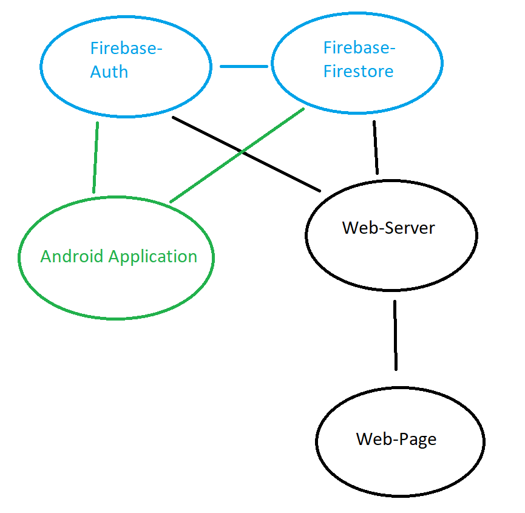

# Σχεδιασμός και Ανάπτυξη Εφαρμογών Κινητού Υπολογισμού

## Mobile Application

### Λειτουργίες
Στην εφαρμογή κινητού για android που υλοποιήθηκε υποστηρίζονται οι εξής λειτουργίες 

- Σύνδεση / Δημιουργία λογαρισμού.
- Εμφάνιση σε  google map χάρτη όλες τις αιτήσεις με ανάλογο χρώμα σημαιάκι.
- Δημιουργία αίτησης με τα απαραίτητα χαρακτηριστικά (δεν υλοποιήθηκε το υποχρεωτικί πεδιο περιβαλοντικης εκθεσης)
- Δυνατότητα επεξεργασιας αίτησης.

### Τεχνολογίες

- Java
- Firebase Firestore
- Firebase Auth
- Google Maps SDK

## Server, Web Page

### Λειτουργίες

Ο διακομιστής υποστηρίζει τις εξής λειτουργίες 

- Σύνδεση εξουσιοδοτιμένου χρήστη
- Αποστολή δεδομένων που έχει λάβει απο τη βάση Firestore του Firebase για την καταλληλη εμφάνιση των αιτήσεων στο χάρτη
- Λίστα αιτήσεων ταξινομημένες
- Δυνατότητα επεξεργασίας των αιτήσεων και αλλαγή κατάστασης.
- Σελίδα στατιστικών

### Τεχνολογίες

- Node.js (server) start server : **npm run start**
- Express.js (Routing,Web API)
- Handlebars.js (Front-End framework for serving the data from the server).
- Firebase Firestore
- Firebase Auth
- Google Maps SDK
- JQuery (Χρείαστηκε να γραφτεί javascript στο front-end)

# Youtube Link
(https://youtu.be/emXx41mSDII)

## Αρχιτεκτονική

